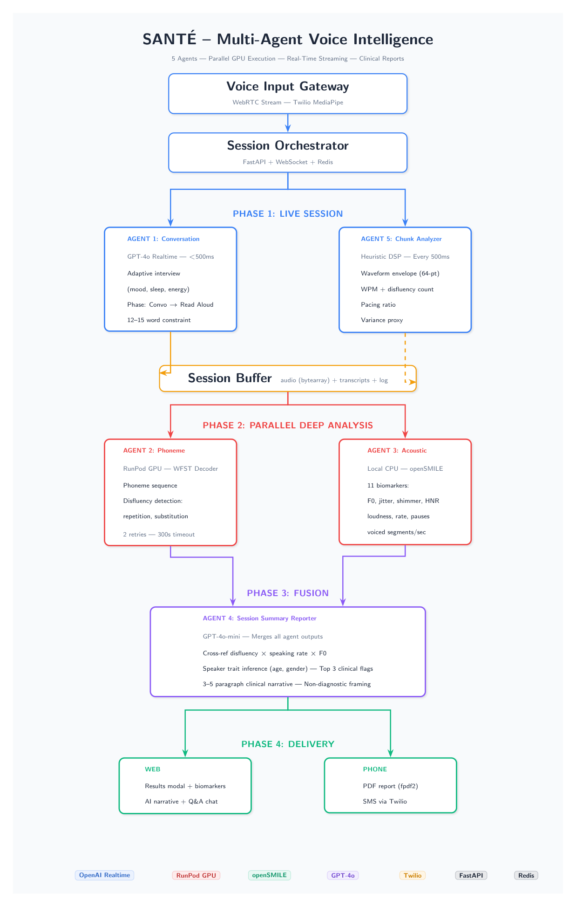

# Santé

Voice intelligence platform for healthcare calls, built to capture diagnostic signal that is usually lost in discovery and onboarding conversations.

## Intended users

- Patients, whose voice interactions can be turned into structured, longitudinal signal instead of one-off notes.
- Doctors and care teams, who need faster, more objective call-derived evidence during triage, diagnosis support, and onboarding.

## Short pitch

Healthcare runs on phone calls, but critical diagnostic context is routinely lost during discovery calls. Santé transforms each call into actionable intelligence through real-time structured voice agents that analyze both acoustic and phonemic features, helping accelerate diagnosis support and patient onboarding. The opportunity sits in a fast-growing, multi-billion-dollar voice-health market (commonly cited around ~2.2x YoY in adjacent segments), and addresses today’s fragile heuristic-heavy workflows with reproducible signal capture.

## Technical pitch

Santé deploys specialized ASR, phoneme classification, and acoustic feature extraction models on RunPod serverless GPU endpoints, orchestrated by a multi-agent pipeline that processes voice streams in parallel. This architecture is designed to make voice biomarker detection scalable and cost-aware, turning everyday conversations into structured diagnostic opportunities.

## Why now: DysfluentWFST

Our clinical/research direction is aligned with the recent Berkeley DysfluentWFST release, treated in this project as a cutting-edge phoneme/disfluency foundation for healthcare voice analysis. The goal is to pair that frontier phoneme modeling with acoustic biomarkers and workflow-ready summaries for real-world clinical operations.

## Fast start

1. Read [Setup Guide](docs/SETUP.md)
2. Copy [backend/.env.example](backend/.env.example) to `backend/.env`
3. Start backend from `backend/`
4. Start frontend from `frontend/`

## Architecture

- System design and data flows: [Architecture](docs/ARCHITECTURE.md)
- API and WebSocket contracts: [API Reference](docs/API_REFERENCE.md)

## External integrations

### RunPod

- Primary guide: [RunPod Integration](docs/integrations/RUNPOD.md)

### Other services

- OpenAI Realtime + Chat APIs: [OpenAI Integration](docs/integrations/OPENAI.md)
- Twilio voice + SMS/MMS: [Twilio Integration](docs/integrations/TWILIO.md)
- Redis + rq async jobs: [Redis Integration](docs/integrations/REDIS.md)
- openSMILE acoustic extraction: [openSMILE Integration](docs/integrations/OPENSMILE.md)

## Documentation index

- [Setup Guide](docs/SETUP.md)
- [Architecture](docs/ARCHITECTURE.md)
- [API Reference](docs/API_REFERENCE.md)
- [RunPod Integration](docs/integrations/RUNPOD.md)
- [OpenAI Integration](docs/integrations/OPENAI.md)
- [Clinician Guide](docs/CLINICIAN_GUIDE.md)
- [Benchmark Results](BENCHMARK_RESULTS.md)

## Current stack

- Frontend: Next.js 16, React 19, Zustand, Tailwind CSS
- Backend: FastAPI, websockets, openSMILE, fpdf2
- Async: Redis + rq worker jobs
- External AI/ML: OpenAI APIs + RunPod serverless endpoints

## Clinical/research framing

Santé outputs are exploratory, quality-weighted signal estimates intended for screening support and structured follow-up, not standalone diagnosis. Any high-risk or urgent signal should be reviewed by qualified clinicians and integrated with broader clinical context.