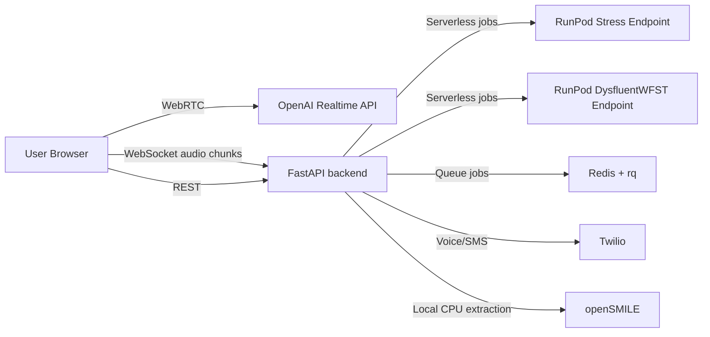

# Santé Architecture

## System overview

Santé currently has two runnable app surfaces in the repository:

1. **Production-oriented split stack**
   - Frontend: `frontend/` (Next.js)
   - Backend: `backend/` (FastAPI)
2. **Legacy single-app surface**
   - Root FastAPI app: `main.py` with static assets in `static/` and `templates/`

The active product direction is the split stack (`frontend/` + `backend/`).

## High-level topology

## Browser session flow

1. Frontend requests ephemeral token from `GET /token/{segment}`.
2. Frontend opens WebRTC session to OpenAI Realtime.
3. Frontend captures local chunks (`MediaRecorder`) and streams to backend `WS /ws/analysis/{session_id}`.
4. Backend computes near-real-time waveform and F0 pitch and returns frames.
5. On session end, frontend submits full audio for batch analyses:
   - phoneme/disfluency (RunPod WFST)
   - acoustic biomarkers (openSMILE)
6. Backend composes full report and optional forwarding actions.

## Phone call flow (Twilio)

1. Twilio hits `POST /twilio/voice`.
2. Backend returns TwiML `<Connect><Stream>` to `WS /twilio/media-stream/{call_sid}`.
3. `CallBridge` performs bidirectional audio conversion and relays with OpenAI Realtime.
4. On call completion (`POST /twilio/status`), backend enqueues `workers.call_analysis_job.process_call`.
5. Worker performs analysis, generates PDF, sends SMS/MMS, and optionally forwards clinician alerts.

## Core backend subsystems

- `routers/`: API and WS contracts (`analysis`, `summary`, `websocket`, `twilio_voice`, `benchmark`, `tokens`)
- `services/`: conversion, DSP, queueing, policy, and delivery helpers
- `agents/`: model-facing adapters and report generation intelligence
- `workers/`: long-running async processing jobs

## Safety and escalation model

Santé applies dual-layer safety triage at summary time:

- rules layer (keyword + context heuristics)
- optional LLM layer (`gpt-4o-mini`) with confidence thresholds

Merged safety output can trigger urgent escalation and bypass normal forwarding score thresholds.

## Data and artifacts

- Benchmark run data: `backend/static/reports/benchmarks/*.jsonl`
- Exported PDFs: `backend/static/reports/`
- Temporary audio: generated during WS and Twilio workflows, cleaned by worker paths where possible

## Related docs

- RunPod deep dive: [integrations/RUNPOD.md](integrations/RUNPOD.md)
- Local setup: [SETUP.md](SETUP.md)
- API reference: [API_REFERENCE.md](API_REFERENCE.md)
